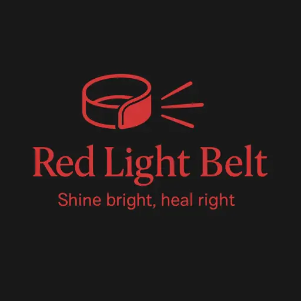

# Franz Ivan Works — Portfolio Website

A single-page portfolio website for a video editor, built with plain HTML, CSS, and JavaScript. Features a floating glassmorphism navbar, video carousel, brand logo marquee, client testimonials with video previews, and a contact form.

## 🚀 Features

- **Floating glass navbar** with active-link highlighting and a responsive **hamburger menu** for mobile
- **Video carousel** ("My Final Cuts") with category tabs (UGC, AI Videos, VSL Videos, Winning Ads), prev/next navigation, and pagination indicators
- **Brands section** with an auto-scrolling logo marquee
- **Clients / Testimonials section** with hover-to-preview video cards and a full video modal popup
- **Text reviews** with star ratings
- **Contact form** wired to [Formspree](https://formspree.io) for email submissions, with loading/success/error states
- **Back-to-top button** and ambient background glow effects
- Fully responsive layout (breakpoint at `768px`)

## 📁 Project Structure

```
├── index.html      # Main page markup (all sections)
├── style.css       # All styling, CSS variables, responsive rules
├── script.js       # Nav toggle, carousel/modal, tabs, contact form logic
```

## 🧩 Page Sections

| Section | ID | Description |
|---|---|---|
| Navbar | — | Logo, nav links, Book Now button, hamburger menu (mobile) |
| Final Cuts | `#works` | Featured video carousel with category filters |
| Brands | `#brands` | Scrolling logo marquee of brands worked with |
| Clients | `#clients` | Client video testimonials with modal playback |
| Testimonials | `#testimonials` | Written client reviews |
| Contact | `#contact` | Contact info cards + Formspree submission form |
| Footer | — | Logo, quick links, copyright |

## 🛠️ Setup

1. Clone or download the project files.
2. Open `index.html` in a browser — no build step or dependencies required.
3. **Set up the contact form:**
   - Create a free form at [formspree.io](https://formspree.io)
   - Replace `YOUR_FORMSPREE_ID` in `index.html` (inside the `<form action="...">` attribute) with your actual Formspree endpoint ID
4. Replace placeholder content:
   - Video sources (`video1.mp4`, `video2.mp4`, `video3.mp4`, etc.)
   - Brand names in the `.brand-logo-card` elements
   - Contact links (email, Instagram, TikTok, Discord)
   - Testimonial names/quotes

## 🎨 Customization

Colors, fonts, and spacing are controlled through CSS variables defined in `:root` in `style.css` — edit these to re-theme the site:

```css
--bg-black: #08080a;
--card-bg: rgba(22, 22, 28, 0.6);
--glass-border: rgba(255, 255, 255, 0.08);
--text-main: #ffffff;
--text-muted: #9e9ea7;
--gradient-accent: linear-gradient(135deg, #ff2a2a 0%, #ff9900 100%);
```

## 📱 Responsive Navbar

On screens ≤768px wide, the nav links collapse behind a hamburger icon (`#navToggle`). Tapping it toggles a dropdown (`#navLinks.active`) with smooth height/opacity transitions, and the menu auto-closes when a link is tapped.

## 📜 License

Personal portfolio project — customize freely for your own use.


.tm-title-group h2 {
  font-size: 38px;
  font-weight: 700;
  margin: 0;
}

/* Accent green line below title */
.tm-title-group::after {
  content: '';
  display: block;
  width: 45px;
  height: 3px;
  background-color: #ff9900;
  margin-top: 10px;
  border-radius: 2px;
}


  color: #ff5500; /* Vibrant Orange accent */


background: linear-gradient(135deg, #ff6600 0%, #ff3300 100%);


sa footer

.navbar-container {
  display: flex;
  justify-content: space-between; /* Hihiwalay ang Logo at Links */
  align-items: center;            /* Pantay na vertical alignment */
  max-width: 1200px;              /* Magsisilbing hangganan */
  width: 90%;                     /* May allowance sa magkabilang gilid */
  margin: 0 auto;                 /* Para ma-CENTER sa screen */
  padding: 20px 0;
}

/* Siguraduhing mag-w-wrap ang links kung masyadong madiit sa mobile */
.nav-links {
  display: flex;
  gap: 20px;
  flex-wrap: wrap; 
}


transform: translateY(-50px);


            <!-- BRANDS SECTION -->
        <section class="section-brands-section" id="brands">
            <div class="container-section">
                <div class="section-title-center">
                    <span class="eyebrow-tag center">TRUSTED PARTNERSHIPS</span>
                    <h2 class="sub-heading">BRANDS I'VE WORKED WITH</h2>
                </div>
                
                <div class="brands-carousel-wrapper" id="brands-carousel">
                    <div class="brands-track" id="brands-track">
                        <div class="brand-logo-card"><span>RedLigth therapy belt

                        </span></div>
                        <div class="brand-logo-card"><span>Goda</span></div>
                        <div class="brand-logo-card"><span>Primal Remedies</span></div>
                        <div class="brand-logo-card"><span>Soursop</span></div>
                        <div class="brand-logo-card"><span>Ryze</span></div>
                        <div class="brand-logo-card"><span>Prime Honey pack</span></div>
                        <div class="brand-logo-card"><span>Mellonest</span></div>

                        <div class="brand-logo-card"><span>Liposhorts</span></div>
                        <div class="brand-logo-card"><span>Velaxen</span></div>
                        <div class="brand-logo-card"><span>HeldHonest</span></div>
                        <div class="brand-logo-card"><span>Nuflos lymphatic drainage</span></div>
                        <!-- Duplicate set for seamless looping -->
                        <div class="brand-logo-card"><span>RedLigth therapy belt</span>
                        </div>
                        <div class="brand-logo-card"><span>Goda</span></div>
                        <div class="brand-logo-card"><span>Primal RemediesL</span></div>
                        <div class="brand-logo-card"><span>Soursop</span></div>


                        <div class="brand-logo-card"><span>Ryze</span></div>
                        <div class="brand-logo-card"><span>Prime Honey pack</span></div>
                        <div class="brand-logo-card"><span>Mellonest</span></div>

                        <div class="brand-logo-card"><span>Liposhorts</span></div>
                        <div class="brand-logo-card"><span>Velaxen</span></div>
                        <div class="brand-logo-card"><span>HeldHonest</span></div>
                        <div class="brand-logo-card"><span>Nuflos lymphatic drainage</span></div>
                    </div>
                </div>
            </div>
        </section>


<!-- BRANDS SECTION -->
<section class="section-brands-section" id="brands">
    <div class="container-section">
        <div class="section-title-center">
            <span class="eyebrow-tag center">TRUSTED PARTNERSHIPS</span>
            <h2 class="sub-heading">BRANDS I'VE WORKED WITH</h2>
        </div>

        <div class="brands-carousel-wrapper" id="brands-carousel">
            <div class="brands-track" id="brands-track">

                <div class="brand-logo-card">
                    
                    <span class="brand-name">RedLight Therapy Belt</span>
                </div>
                <div class="brand-logo-card">
                    
                    <span class="brand-name">Goda</span>
                </div>
                <div class="brand-logo-card">
                    
                    <span class="brand-name">Primal Remedies</span>
                </div>
                <div class="brand-logo-card">
                    
                    <span class="brand-name">Soursop</span>
                </div>
                <div class="brand-logo-card">
                    
                    <span class="brand-name">Ryze</span>
                </div>
                <div class="brand-logo-card">
                    
                    <span class="brand-name">Prime Honey Pack</span>
                </div>
                <div class="brand-logo-card">
                    
                    <span class="brand-name">Mellonest</span>
                </div>
                <div class="brand-logo-card">
                    
                    <span class="brand-name">Liposhorts</span>
                </div>
                <div class="brand-logo-card">
                    
                    <span class="brand-name">Velaxen</span>
                </div>
                <div class="brand-logo-card">
                    
                    <span class="brand-name">HeldHonest</span>
                </div>
                <div class="brand-logo-card">
                    
                    <span class="brand-name">Nuflos Lymphatic Drainage</span>
                </div>

                <!-- Duplicate set for seamless looping -->
                <div class="brand-logo-card">
                    
                    <span class="brand-name">RedLight Therapy Belt</span>
                </div>
                <div class="brand-logo-card">
                    
                    <span class="brand-name">Goda</span>
                </div>
                <div class="brand-logo-card">
                    
                    <span class="brand-name">Primal Remedies</span>
                </div>
                <div class="brand-logo-card">
                    
                    <span class="brand-name">Soursop</span>
                </div>
                <div class="brand-logo-card">
                    
                    <span class="brand-name">Ryze</span>
                </div>
                <div class="brand-logo-card">
                    
                    <span class="brand-name">Prime Honey Pack</span>
                </div>
                <div class="brand-logo-card">
                    
                    <span class="brand-name">Mellonest</span>
                </div>
                <div class="brand-logo-card">
                    
                    <span class="brand-name">Liposhorts</span>
                </div>
                <div class="brand-logo-card">
                    
                    <span class="brand-name">Velaxen</span>
                </div>
                <div class="brand-logo-card">
                    
                    <span class="brand-name">HeldHonest</span>
                </div>
                <div class="brand-logo-card">
                    
                    <span class="brand-name">Nuflos Lymphatic Drainage</span>
                </div>

            </div>
        </div>
    </div>
</section>

